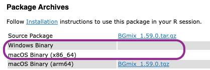

```{r setup, include=FALSE}
knitr::opts_chunk$set(echo = TRUE, eval = interactive())
```

# Introduction

Use the [BiocManager][1] package to install and manage packages from the
_[Bioconductor][2]_ project for the statistical analysis and comprehension of
high-throughput genomic data.

Current _Bioconductor_ packages are available on a 'release' version intended
for every-day use, and a 'devel' version where new features are introduced. A
new release version is created every six months. Using the [BiocManager][1]
package helps users install packages from the same release.

# Basic use

## Installing _R_

We recommend using the current 'release' version of _R_. [Follow
instructions][6] for installing _R_.

## Installing _BiocManager_

Use standard _R_ installation procedures to install the
[BiocManager][1] package. This command is requried only once per _R_
installation.

```{r, eval = FALSE}
install.packages("BiocManager", repos = "https://cloud.r-project.org")
```

## Installing _Bioconductor_, _CRAN_, or GitHub packages

Install _Bioconductor_ (or CRAN) packages with

```{r, eval = FALSE}
BiocManager::install(c("GenomicRanges", "Organism.dplyr"))
```

Installed packages can be updated to their current version with

```{r, eval = FALSE}
BiocManager::install()
```

## Previous releases

To install CRAN package versions consistent with previous releases of
Bioconductor, use the [BiocArchive][BiocArchive] package. BiocArchive enables
contemporary installations of CRAN packages with out-of-date _Bioconductor_
releases using [Posit Package Manager][RSPM].

[BiocArchive]: https://github.com/Bioconductor/BiocArchive
[RSPM]: https://packagemanager.posit.co/client/#/repos/2/overview

## Version and validity of installations

Use `version()` to discover the version of _Bioconductor_ currently in
use.

```{r}
BiocManager::version()
```

_Bioconductor_ packages work best when they are all from the same release. Use
`valid()` to identify packages that are out-of-date or from unexpected
versions.

```{r}
BiocManager::valid()
```

`valid()` returns an object that can be queried for detailed
information about invalid packages, as illustrated in the following
screen capture

```
> v <- valid()
Warning message:
6 packages out-of-date; 0 packages too new
> names(v)
[1] "out_of_date" "too_new"
> head(v$out_of_date, 2)
    Package LibPath
bit "bit"   "/home/mtmorgan/R/x86_64-pc-linux-gnu-library/3.5-Bioc-3.8"
ff  "ff"    "/home/mtmorgan/R/x86_64-pc-linux-gnu-library/3.5-Bioc-3.8"
    Installed Built   ReposVer Repository
bit "1.1-12"  "3.5.0" "1.1-13" "https://cloud.r-project.org/src/contrib"
ff  "2.2-13"  "3.5.0" "2.2-14" "https://cloud.r-project.org/src/contrib"
>
```

## Available packages

Packages available for your version of _Bioconductor_ can be
discovered with `available()`; the first argument can be used to
filter package names based on a regular expression, e.g., 'BSgenome'
package available for _Homo sapiens_

```{r}
avail <- BiocManager::available()
length(avail)                               # all CRAN & Bioconductor packages
BiocManager::available("BSgenome.Hsapiens") # BSgenome.Hsapiens.* packages
```

Questions about installing and managing _Bioconductor_ packages should
be addressed to the [_Bioconductor_ support site][3].

# Advanced use

## Changing version

Use the `version=` argument to update all packages to a specific _Bioconductor_
version

```{r, eval = FALSE}
BiocManager::install(version="3.7")
```

_Bioconductor_ versions are associated with specific _R_ versions, as
summarized [here][5]. Attempting to install a version of
_Bioconductor_ that is not supported by the version of _R_ in use
leads to an error; using the most recent version of _Bioconductor_ may
require installing a new version of _R_.

```
> BiocManager::install(version="3.9")
Error: Bioconductor version '3.9' requires R version '3.6'; see
  https://bioconductor.org/install
```

A special version, `version="devel"`, allows use of _Bioconductor_
packages that are under development.

## Managing multiple versions {#multiple-versions}

It is possible to have multiple versions of _Bioconductor_ installed on the
same computer. A best practice is to [create an initial _R_ installation][6].
Then create and use a library for each version of _Bioconductor_. The library
will contain all _Bioconductor_, CRAN, and other packages for that version of
_Bioconductor_. We illustrate the process assuming use of _Bioconductor_
version 3.7, available using _R_ version 3.5

Create a directory to contain the library (replace `USER_NAME` with your user
name on Windows)

- Linux: `~/R/3.5-Bioc-3.7`
- macOS: `~/Library/R/3.5-Bioc-3.7/library`
- Windows: `C:\Users\USER_NAME\Documents\R\3.5-Bioc-3.7`

Set the environment variable `R_LIBS_USER` to this directory, and invoke _R_.
Command line examples for Linux are

- Linux: `R_LIBS_USER=~/R/3.5-Bioc-3.7 R`
- macOS: `R_LIBS_USER=~/Library/R/3.5-Bioc-3.7/library R`
- Windows: `cmd /C "set R_LIBS_USER=C:\Users\USER_NAME\Documents\R\3.5-Bioc-3.7 && R"`

Once in _R_, confirm that the version-specific library path has been set

```{r, eval = FALSE}
.libPaths()
```

On Linux and macOS, create a bash alias to save typing, e.g.,

- Linux: `alias Bioc3.7='R_LIBS_USER=~/R/3.5-Bioc-3.7 R'`
- macOS: `alias Bioc3.7='R_LIBS_USER=~/Library/R/3.5-Bioc-3.7/library R'`

Invoke these from the command line as `Bioc3.7`.

On Windows, create a shortcut. Go to My Computer and navigate to a directory
that is in your PATH. Then right-click and choose New->Shortcut.
In the "type the location of the item" box, put:

```
cmd /C "set R_LIBS_USER=C:\Users\USER_NAME\Documents\R\3.5-Bioc-3.7 && R"
```

Click "Next". In the "Type a name for this shortcut" box, type `Bioc-3.7`.

## Offline use

Offline use of _BiocManager_ is possible for organizations and users that would
like to provide access to internal repositories of _Bioconductor_ packages
while enforcing appropriate version checks between Bioconductor and R.
For offline use, organizations and users require the following steps:

1. Use `rsync` to create local repositories of [CRAN][8] and
   [Bioconductor][7]. Tell _R_ about these repositories using (e.g.,
   in a site-wide `.Rprofile`, see `?.Rprofile`).

    ```{r, eval = FALSE}
    options(
        repos = c(CRAN_mirror = "file:///path/to/CRAN-mirror"),
        BioC_mirror = "file:///path/to/Bioc-mirror"
    )
    ```

   Validate repository setting by reviewing the output of `repositories()`.

2. Create an environment variable or option, e.g.,

    ```{r, eval = FALSE}
    options(
        BIOCONDUCTOR_ONLINE_VERSION_DIAGNOSIS = FALSE
    )
    ```

3. Use `install.packages()` to bootstrap the BiocManager installation.

    ```{r, eval = FALSE}
    install.package(c("BiocManager", "BiocVersion"))
    ```

BiocManager can then be used for subsequent installations, e.g.,
`BiocManager::install(c("ggplot2", "GenomicRanges"))`.

### Offline config.yaml

_BiocManager_ also expects to reference an online configuration yaml
file for _Bioconductor_ version validation at
https://bioconductor.org/config.yaml. With offline use, users are
expected to either host this file locally or provide their
`config.yaml` version. The package allows either an environment
variable or R-specific option to locate this file, e.g.,

    ```{r, eval = FALSE}
    options(
        BIOCONDUCTOR_CONFIG_FILE = "file:///path/to/config.yaml"
    )
    ```

# How it works

BiocManager's job is to make sure that all packages are installed from
the same _Bioconductor_ version, using compatible _R_ and _CRAN_
packages. However, _R_ has an annual release cycle, whereas
_Bioconductor_ has a twice-yearly release cycle. Also, _Bioconductor_
has a 'devel' branch where new packages and features are introduced,
and a 'release' branch where bug fixes and relative stability are
important; _CRAN_ packages do not distinguish between devel and
release branches.

In the past, one would install a _Bioconductor_ package by evaluating
the command `source("https://.../biocLite.R")` to read a file from the
web. The file contained an installation script that was smart enough
to figure out what version of _R_ and _Bioconductor_ were in use or
appropriate for the person invoking the script. Sourcing an executable
script from the web is an obvious security problem.

Our solution is to use a CRAN package BiocManager, so that users
install from pre-configured CRAN mirrors rather than typing in a URL
and sourcing from the web.

But how does a CRAN package know what version of _Bioconductor_ is in
use? Can we use BiocManager? No, because we don't have enough control
over the version of BiocManager available on CRAN, e.g., everyone using
the same version of _R_ would get the same version of BiocManager and
hence of _Bioconductor_. But there are two _Bioconductor_ versions per R
version, so that does not work!

BiocManager could write information to a cache on the user disk, but
this is not a robust solution for a number of reasons. Is there any
other way that _R_ could keep track of version information? Yes, by
installing a _Bioconductor_ package (BiocVersion) whose sole purpose is
to indicate the version of _Bioconductor_ in use.

By default, BiocManager installs the BiocVersion package corresponding
to the most recent released version of _Bioconductor_ for the version
of _R_ in use. At the time this section was written, the most recent
version of R is R-3.6.1, associated with _Bioconductor_ release
version 3.9. Hence on first use of `BiocManager::install()` we see
BiocVersion version 3.9.0 being installed.

```
> BiocManager::install()
Bioconductor version 3.9 (BiocManager 1.30.4), R 3.6.1 Patched (2019-07-06
  r76792)
Installing package(s) 'BiocVersion'
trying URL 'https://bioconductor.org/packages/3.9/bioc/src/contrib/\
    BiocVersion_3.9.0.tar.gz'
...
```

Requesting a specific version of _Bioconductor_ updates, if possible,
the BiocVersion package.

```
> ## 3.10 is available for R-3.6
> BiocManager::install(version="3.10")
Upgrade 3 packages to Bioconductor version '3.10'? [y/n]: y
Bioconductor version 3.10 (BiocManager 1.30.4), R 3.6.1 Patched (2019-07-06
  r76792)
Installing package(s) 'BiocVersion'
trying URL 'https://bioconductor.org/packages/3.10/bioc/src/contrib/\
    BiocVersion_3.10.1.tar.gz'
...
> ## back down again...
> BiocManager::install(version="3.9")
Downgrade 3 packages to Bioconductor version '3.9'? [y/n]: y
Bioconductor version 3.9 (BiocManager 1.30.4), R 3.6.1 Patched (2019-07-06
  r76792)
Installing package(s) 'BiocVersion'
trying URL 'https://bioconductor.org/packages/3.9/bioc/src/contrib/\
    BiocVersion_3.9.0.tar.gz'
...
```

Answering `n` to the prompt to up- or downgrade packages leaves the
installation unchanged, since this would immediately create an
inconsistent installation.

# Troubleshooting

## Package not available

(An initial draft of this section was produced by ChatGPT on 25 May 2023)

A user failed to install the 'celldex' package on 25 May 2023. A
transcript of the _R_ session is as follows:

```
> BiocManager::version()
[1] '3.18'
> BiocManager::install("celldex")
Bioconductor version 3.18 (BiocManager 1.30.20), R 4.3.0 Patched (2023-05-01
  r84362)
Installing package(s) 'celldex'
Warning message:
package 'celldex' is not available for Bioconductor version '3.18'

A version of this package for your version of R might be available elsewhere,
see the ideas at
https://cran.r-project.org/doc/manuals/r-patched/R-admin.html#Installing-packages
```

The availability of specific packages within _Bioconductor_ can depend
on various factors, including simple errors in entering the package
name, the package's development status, maintenance, and compatibility
with the latest version of _Bioconductor_, as well as the availability
of CRAN packages that the _Bioconductor_ package depends on.

Package Name: _R_ package names are case sensitive and must be spelt
correctly, so using `BiocManager::install("Celldex")` (with a capital
`C`) or `BiocManager::install("celdex")` (with only one `l`) would
both fail to install `celldex`; _R_ will sometimes suggest the correct
name.

_CRAN_ Packages: `BiocManager::install()` tries to install packages
from CRAN and from _Bioconductor_. Check that the package is not a CRAN
package by trying to visit the CRAN 'landing page'

- `https://cran.R-project.org/package=celldex`

If this page is found, then the package is a CRAN package; see the
[R-admin][9] manual section on troubleshooting CRAN package
installations.

Check also that the package is not a CRAN package that has been
'archived' and no longer available by trying to visit

- `https://cran.R-project.org/src/contrib/Archive/celldex/`

If this page exists but the 'landing page' does not, this means that
the package has been removed from CRAN. While it is possible to
install archived packages, usually the best course of action is to
identify alternative packages to accomplish the task you are
interested in. This is especially true if the 'Last modified' date of
the most recent archived package is more than several months ago.

Compatibility: A _Bioconductor_ package must be available for the
specific version of _Bioconductor_ you are using. Try visiting the
'landing page' of the package for your version of _Bioconductor_,
e.g., for _Bioconductor_ version 3.18 and package celldex

- https://bioconductor.org/packages/3.18/celldex

If this landing page does not exist, then the package is not available
for your version of _Bioconductor_.

Users may sometimes have an out-of-date version of _R_ or
_Bioconductor_ installed; this may be intentional (e.g., to ensure
reproducibility of existing analyses) or simply because _Bioconductor_
has not yet been updated. Try visiting the current release landing
page

- https://bioconductor.org/packages/release/celldex

If the release landing page exists, and it is not important that you
continue using the out-of-date version of _Bioconductor_, consider
updating _R_ (if necessary) and _Bioconductor_ to the current release
versions using instructions at the top of this document.

Packages recently contributed to _Bioconductor_ are added to the
'devel' branch, whereas most users are configured to use the 'release'
branch. Try visiting the 'devel' landing page

- https://bioconductor.org/packages/devel/celldex

If only the devel landing page exists, then consider updating your
installation to use the development version of _Bioconductor_. Note
that the development version is not as stable as the release version,
so should not be used for time-critical or 'production' analysis.

It may be that the package you are interested in has been removed from
_Bioconductor_. Check this by visiting

- https://bioconductor.org/about/removed-packages/

If the package has been removed, the best course of action is to
identify alternative packages to accomplish the task you are
interested in.

Maintenance and Operating System Availability: A package may be
included in the release or devel version of _Bioconductor_, but
currently unavailable because it requires maintenance. This might be
indicated by a red 'build' badge as in the image below (details of the
build problem are available by clicking on the badge). The build error
usually requires that the package maintainer correct an issue with
their package; the maintainer and email address are listed on the
package landing page.

```{r out.width = '100%', echo = FALSE, eval = TRUE}
knitr::include_graphics("img/badges.png")
```

A small number of _Bioconductor_ packages are not available on all
operating systems. An orange 'platforms' badge indicates this. Click
on the badge to be taken to the 'Package Archives' section of the
landing page; BGmix is not supported on Windows, and not available on
'Intel' macOS because of build-related errors. Consider using an
alternative operating system if the package is essential to your work

```{r out.width = '100%', echo = FALSE, eval = TRUE}

```

Packages with landing pages from older releases but not available for
your operating system cannot be updated by the maintainer. If the
package is available in the current release and for your operating
system, consider updating to the current release of _Bioconductor_.

## Cannot load _BiocManager_

After updating _R_ (e.g., from _R_ version 3.5.x to _R_ version 3.6.x
at the time of writing this) and trying to load `BiocManager`, _R_
replies

```
Error: .onLoad failed in loadNamespace() for 'BiocManager', details:
  call: NULL
  error: Bioconductor version '3.8' requires R version '3.5'; see
  https://bioconductor.org/install
```

This problem arises because `BiocManager` uses a second package,
`BiocVersion`, to indicate the version of _Bioconductor_ in use. In
the original installation, `BiocManager` had installed `BiocVersion`
appropriate for _R_ version 3.5. With the update, the version of
_Bioconductor_ indicated by `BiocVersion` is no longer valid -- you'll
need to update `BiocVersion` and all _Bioconductor_ packages to the
most recent version available for your new version of _R_.

The recommended practice is to maintain a separate library for each
_R_ and _Bioconductor_ version. So instead of installing packages into
_R_'s system library (e.g., as 'administrator'), install only base _R_
into the system location. Then use aliases or other approaches to
create _R_ / _Bioconductor_ version-specific installations. This is
described in the section on [maintaining multiple
versions](#multiple-versions) of _R_ and _Bioconductor_.

Alternatively, one could update all _Bioconductor_ packages in the
previous installation directory. The problem with this is that the
previous version of _Bioconductor_ is removed, compromising the
ability to reproduce earlier results. Update all _Bioconductor_
packages in the previous installation directory by removing _all_
versions of `BiocVersion`

```
remove.packages("BiocVersion")  # repeat until all instances removed
```

Then install the updated `BiocVersion`, and update all _Bioconductor_
packages; answer 'yes' when you are asked to update a potentially
large number of _Bioconductor_ packages.

```{r, eval = FALSE}
BiocManager::install()
```

Confirm that the updated _Bioconductor_ is valid for your version of
_R_

```{r, eval = FALSE}
BiocManager::valid()
```

## Timeout during package download

Large packages can take a long time to downloaded over poor internet
connects. The BiocManager package sets the time limit to 300 seconds,
using `options(timeout = 300)`. Only part of a package may download,
e.g., only 15.1 of 79.4 MB in the example below

```
trying URL 'https://bioconductor.org/packages/3.12/data/annotation/src/contrib/org.Hs.eg.db_3.12.0.tar.gz'
Content type 'application/x-gzip' length 83225518 bytes (79.4 MB)
=========
downloaded 15.1 MB
```

or perhaps with a warning (often difficult to see in the output)

```
Error in download.file(url, destfile, method, mode = "wb", ...) :
...
...: Timeout of 300 seconds was reached
...
```

Try increasing the download timeout, e.g, `options(timeout = 600)`.

## Multiple `BiocVersion` installations

One potential problem occurs when there are two or more `.libPaths()`,
with more than one BiocVersion package installed. This might occur for
instance if a 'system administrator' installed BiocVersion, and then a
user installed their own version. In this circumstance, it seems
appropriate to standardize the installation by repeatedly calling
`remove.packages("BiocVersion")` until all versions are removed, and
then installing the desired version.

## Errors determining _Bioconductor_ version

An essential task for _BiocManager_ is to determine that the version
of _Bioconductor_ is appropriate for the version of _R_. Several
errors can occur when this task fails.

- Bioconductor version cannot be determined; no internet connection?
  When the _Bioconductor_ version cannot be obtained from the version
  map hosted at https://bioconductor.org/config.yaml, this error will
  occur.  It may be a result of poor internet connectivity or offline
  use. See the [offline config.yaml](#offline-config.yaml) section
  above.

- Bioconductor version cannot be validated; no internet connection?
  Usually occurs when the map is unable to be downloaded possibly due
  to a missing `BIOCONDUCTOR_CONFIG_FILE`. For offline use, a copy of
  the configuration file should be downloaded and its address set to
  the environment variable or option.

- Bioconductor version map cannot be validated; is it misconfigured?
  On _rare_ occasion, the version map hosted at
  https://bioconductor.org/config.yaml may be misconfigured. The check
  ensures that all the version name tags, i.e., out-of-date, release,
  devel, and future are in the map.

- Bioconductor version cannot be validated; is type input
  mis-specified? The type input refers to the version name inputs,
  mainly release and devel.  This error is chiefly due to internal
  logic and is not due to user error.  Please open a [GitHub
  issue][10].

# Session information

```{r, eval = TRUE}
sessionInfo()
```

[1]: https://cran.r-project.org/package=BiocManager
[2]: https://bioconductor.org
[3]: https://support.bioconductor.org
[5]: https://bioconductor.org/about/release-announcements/
[6]: https://cran.R-project.org/
[7]: https://bioconductor.org/about/mirrors/mirror-how-to/
[8]: https://cran.r-project.org/mirror-howto.html
[9]: https://cran.r-project.org/doc/manuals/r-patched/R-admin.html#Installing-packages
[10]: https://github.com/Bioconductor/BiocManager/issues
